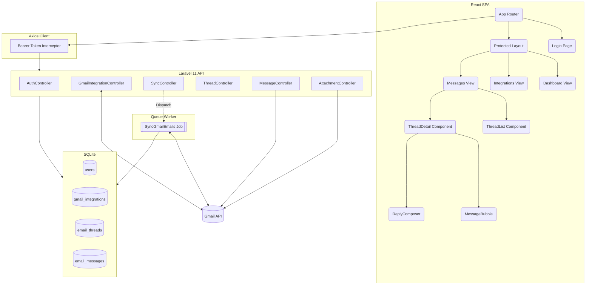
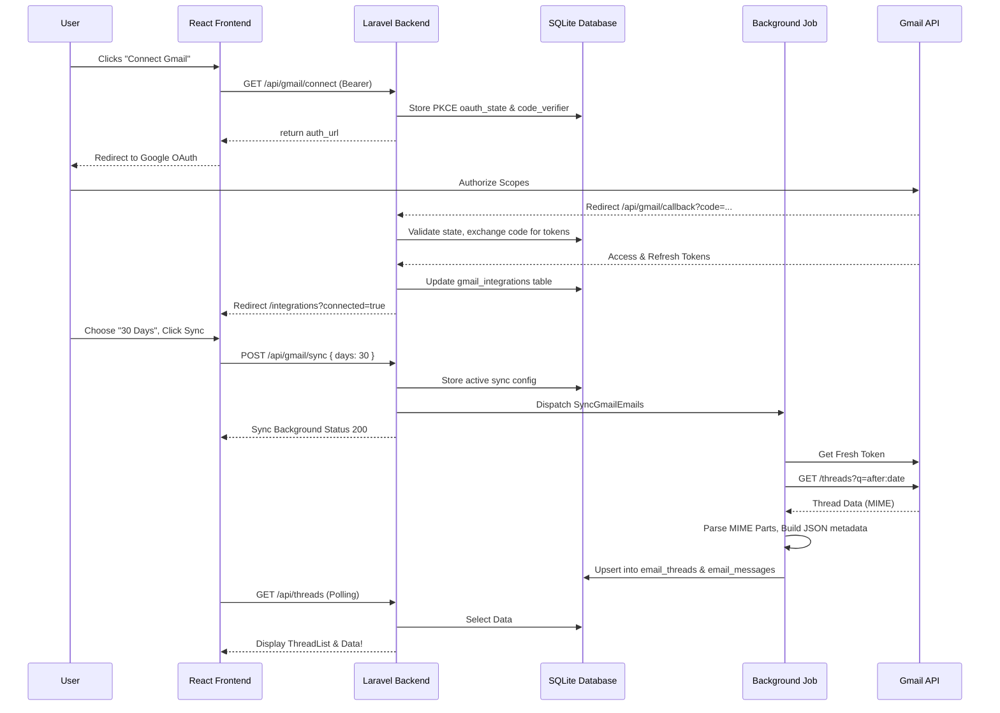

# BeyondChats Email Integration Dashboard 🚀
A full-stack industrial-minimal email integration dashboard providing real-time Gmail inbox sync, nested threading, inline replier handling, and raw attachment fetching. 

## Features
- **User Authentication**: Registration & login secured with Laravel Sanctum Bearer token auth and bcrypt hashed passwords.
- **Gmail OAuth 2.0 PKCE**: Direct Google Workspace authorization flow, validating `code_verifier` parameters and seamlessly dropping into the app pipeline. 
- **Asynchronous Deep Email Sync**: Configurable background Laravel Queue Job targeting Gmail API (`threads.list` + `threads.get`), downloading custom date ranges, tearing down complex MIME trees, parsing inline base64 HTML payloads natively, and caching to SQLite.
- **Incremental Syncing**: Blazing fast `history.list` polling dropping the diff payload natively into Laravel instead of fetching entire history trees.
- **Read & Manage Messages**: Master-detail two-panel layout routing. Safely scopes untrusted sandboxed HTML payloads natively inside secure styling viewports.
- **Smart Inbox Triageing**: Highlights sender/receiver metadata uniquely along with the nested threaded `message_count`. 
- **Offline Rule-Based Priority Tagging**: An explicit architectural decision to use a secure, rule-based PHP regex engine over a third-party AI API (like OpenAI) to categorize emails (Urgent, Follow-up, Resolved) completely offline. **No confidential business emails ever leave the server** to be processed by a third party, maximizing user privacy.
- **Attachment Lazy-Loading**: Stores raw metadata during Inbox parsing (`{attachmentId, filename}`), fetching the binary stream `base64url` ONLY when a user deliberately attempts a download to reduce API overhead limits! 
- **RFC 2822 Smart Reply Chain**: Crafts nested thread payload identifiers natively via `In-Reply-To`, `References`, and `threadId` metadata keeping inline conversational integrity when replying from the Dashboard.
- **Responsive Views**: Operates natively in Desktop & Mobile.

## Tech Stack
| Component | Technology | Description |
|-----------|-----------|-------------|
| **Frontend UI** | ReactJS (Vite) | Frontend SPA scaffolding |
| **Routing** | React Router v6 | Native client-side views |
| **State/Data** | TanStack Query & Axios | Async mutation polling + global Bearer token interceptors |
| **Design** | Tailwind CSS / Inline CSS | Industrial-minimal, Bloomberg-style typography |
| **Backend Engine**| Laravel 11 (PHP) | Enterprise-grade backend |
| **Database**| SQLite | Rapid file-based embedded SQL |
| **Authentication**| Laravel Sanctum | Token-issued stateless authentication |
| **Queue Workers**| Laravel Queues (Database) | Handles long-running thread polling |
| **Cloud APIs**| Gmail API | Full Google Cloud Platform (GCP) Scope implementation |

---

## Architecture Diagram


---

## Data Flow Diagram


---

## Environment Variables
Create the following variable sets in your respective directories before launching the application:

### Backend (`backend/.env`)
```env
APP_NAME=Laravel
APP_ENV=local
APP_KEY=base64:...
APP_DEBUG=true
APP_URL=http://localhost

DB_CONNECTION=sqlite
QUEUE_CONNECTION=database

GOOGLE_CLIENT_ID=your_gcp_client_id.apps.googleusercontent.com
GOOGLE_CLIENT_SECRET=your_gcp_client_secret
GOOGLE_REDIRECT_URI=http://localhost:8000/api/gmail/callback

FRONTEND_URL=http://localhost:5173
```

### Frontend (`frontend/.env`)
```env
VITE_API_URL=http://localhost:8000/api
```

---

## Local Setup Instructions

### 1. Backend Initialization (Laravel)
Navigate to the `backend/` directory:
1. Ensure you have PHP 8.2+ installed and Composer.
2. Install dependencies:
   ```bash
   composer install
   ```
3. Configure your environment variables. Copy the example file and generate your application key:
   ```bash
   cp .env.example .env
   php artisan key:generate
   ```
4. **Configure your Database & Credentials:** Open `.env` and configure your credentials. Crucially, insert your `GOOGLE_CLIENT_ID` and `GOOGLE_CLIENT_SECRET` generated from the Google Cloud Console. Enable the *Gmail API*.
5. Set your internal SQLite logic and prepare databases:
   ```bash
   touch database/database.sqlite
   php artisan migrate
   ```
6. Boot up the local webserver:
   ```bash
   php artisan serve
   ```
   *(Running locally at http://localhost:8000)*
6. **[CRITICAL]** In a separate terminal window, ensure you spin up the Laravel Background Queue configuration to process the Async Inbox Gmail mappings:
   ```bash
   php artisan queue:work
   ```

### 2. Frontend Initialization (React)
Navigate to the `frontend/` directory (separate terminal):
1. Install Node modules:
   ```bash
   npm install
   ```
2. Setup Frontend Environment:
   ```bash
   cp .env.example .env
   ```
   *(Ensure `VITE_API_URL` is pointing correctly to your Laravel backend)*
3. Run the Vite development server:
   ```bash
   npm run dev
   ```
   *(Running locally at http://localhost:5173)*

You can now visit the App locally, register your basic User Credentials via the Login / Signup port, hit the `/integrations` endpoint, and Map out the Gmail Auth! 

---

## API Reference

| Method | Endpoint | Auth | Description |
|--------|----------|------|-------------|
| **POST** | `/api/register` | Open | User Registration |
| **POST** | `/api/login` | Open | Authenticate & Return Token |
| **POST** | `/api/logout` | Bearer | Revoke Identity |
| **GET** | `/api/me` | Bearer | Fetch Current Scope Metadata |
| **GET** | `/api/gmail/connect` | Bearer | Generate Google Auth2 PKCE URL |
| **GET** | `/api/gmail/callback` | Open | Internal OAuth Google Redirect capture |
| **GET** | `/api/gmail/status` | Bearer | See Current DB sync/token scope connection status |
| **DELETE** | `/api/gmail/disconnect`| Bearer | Burn integration IDs, tear down states |
| **POST** | `/api/gmail/sync` | Bearer | Body `{days: int}`. Dispatch Async Setup Pipeline |
| **POST** | `/api/gmail/resync` | Bearer | Dispatch Async Incremental Sync Job |
| **GET** | `/api/threads` | Bearer | Fetch nested relational thread paginated JSON payload |
| **GET** | `/api/threads/{id}` | Bearer | Fetch all isolated Message history on Thread |
| **POST** | `/api/threads/{id}/reply` | Bearer | Body `{body: string}` Send Native Gmail |
| **GET** | `/api/attachments/{msgId}/{attcId}`| Bearer | Internal GCP Byte-Stream to Binary Blob |

---

## Demo Video
[Watch the demo on Loom](https://www.loom.com/share/a6763d0f39294f6f8315e84836de1995)

---

### Submission Notes
- Constructed natively over frequent incremental repository commits representing functional block design principles. 
- Deep responsive breakpoints natively wrapping viewport constraints correctly handling `overflow` and grid constraints. 
- Open-Source / Public mapping availability attached!
